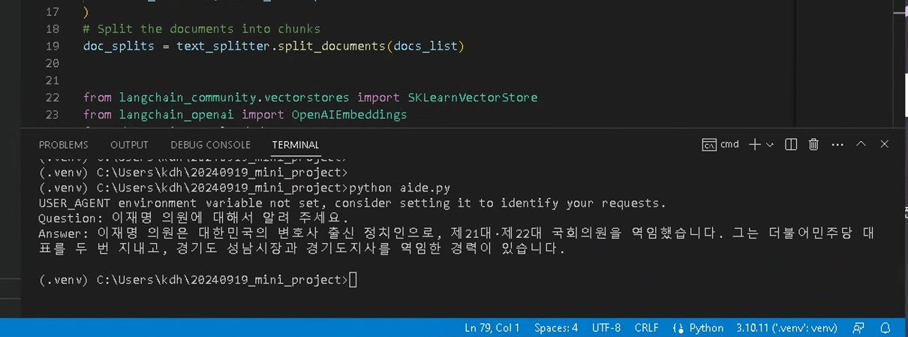

# 국회의원실 막내 보좌관 AI

## 미니 프로젝트 개요

* 국회의원실 막내 보좌관에 역할을 수행하는 AI
* 국회의원실 막내 주요 업무
    * 의원님의 활동에 필요한 자료를 준비
        * 입법에 관한 자료 수집
        * 발의안 작성
        * 질의서 작성
    * 의원 참여 행사
        * 간담회 등 행사, 기획, 모집, 홍보, 진행
        * 축사
        * SNS 메시지 작성
        * 발표자료 작성
    * RAG로 넣을 데이터
        * 국회의원 정보
        * 국회의원 Wikipedia
        * 국회의원 블로그


다음의 사전학습된 모델을 사용:

* 임베딩 모델
  * OpenAI 임베딩 모델
* LLM 모델
  * Ollama : Llama 3.1 8b(4INT 양자화) 모델

## 동작 방식

1. OpenAI 임베딩 모델을 사용하여, 문서를 벡터스토어에 저장
2. SKLearnVectorStore에서 유사도 검색
3. 질의와 검색결과를 함께 프롬프트를 생성하고, 이를 LLM(Ollama : Llama 3.1 8b)에 보냄
4. 답변 결과를 화면에 출력

## OpenAI API 키 생성
``` sh
vi .env
# OPENAI_API_KEY= "YOUR API KEY"
```


## 의존성 패키지 설치

``` sh
pip install -r requirements.txt
```

## 실행

Ollama run 이후, 아래의 명령어 실행

Windows (`cmd`, `powershell`)에서 실행한 명령어:

``` sh
python aide.py
```

## 실행화면

